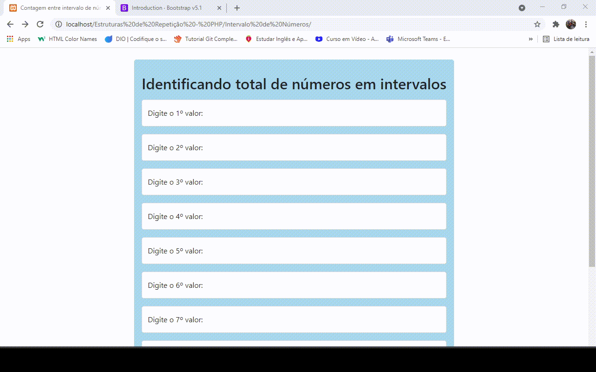

# Contador de intervalo de números

Contador que identifica quantos números estão entre determinado intervalo de números. Para exibir o resultado dos números que estão entre os intervalos que cito logo abaixo, procurei exibir eles em uma mensagem de alerta simples.

**Exemplo:** O número 15 está entre o intervalo dos números 10 e 20 por exemplo, logo há 1 número entre este intervalo.

**Os seguintes intervalos de números que defini no sistema são:**
- 0 à 25, 26 à 50, 51 à 75 e 76 à 100. 

 

# Resultado
